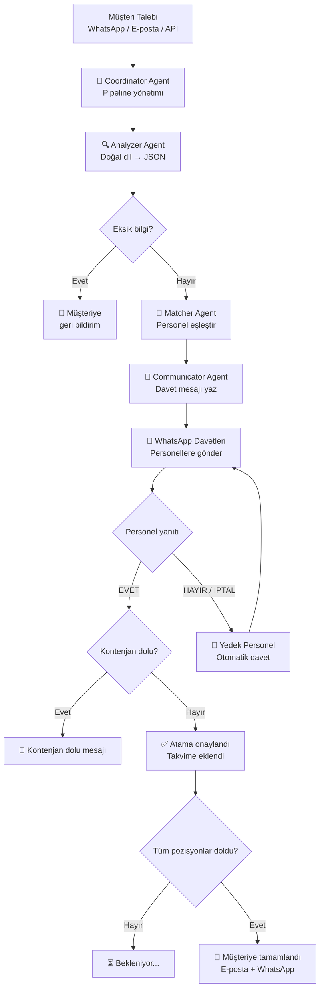
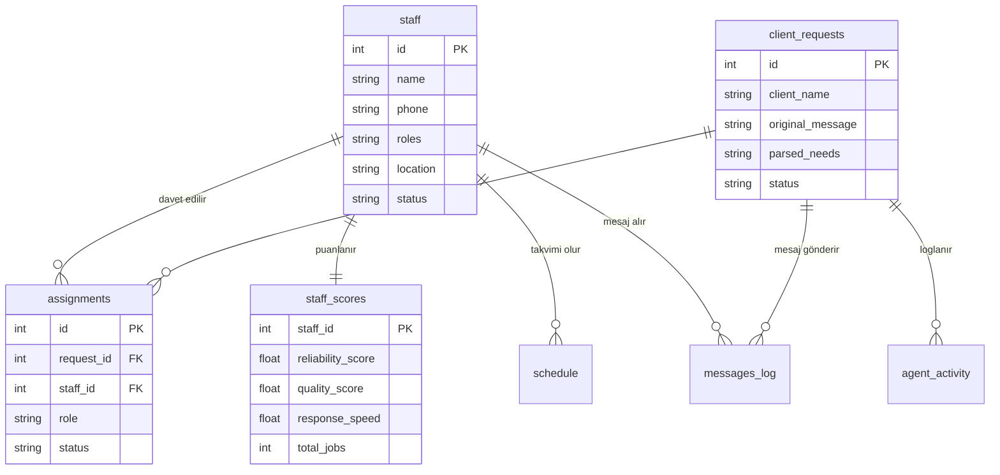
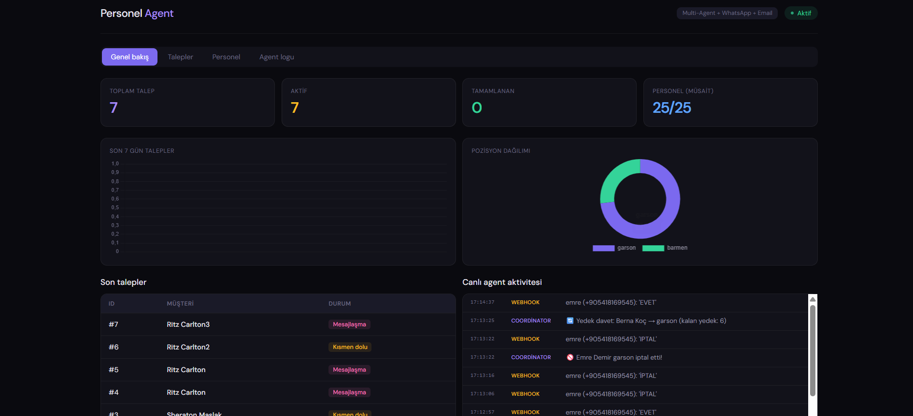
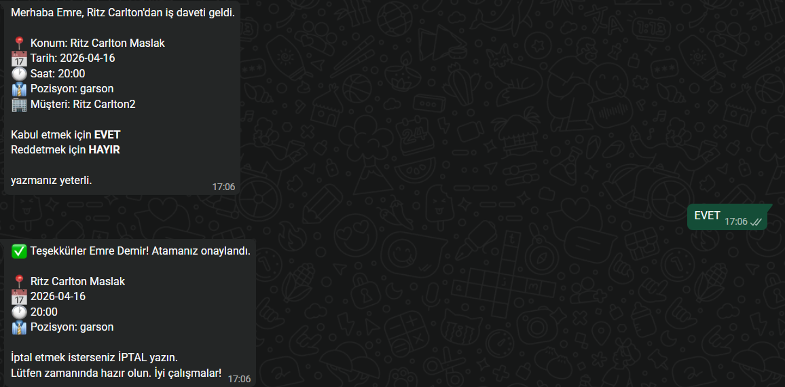
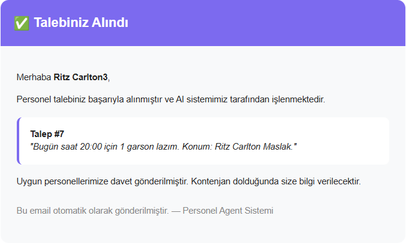

# Otonom Personel Yönetim Agent'ı

> Yapay Zeka dersi bitirme projesi — Multi-Agent AI ile otel ve etkinlik sektörü için otonom personel yönetim sistemi.

Müşteri mesajını okur, pozisyon/tarih/konum bilgilerini otomatik çıkarır, uygun personele WhatsApp daveti gönderir ve süreci uçtan uca yönetir.

## Özellikler

- **Multi-Agent Pipeline** — Coordinator, Analyzer, Matcher, Communicator: her agent kendi uzmanlık alanında çalışır
- **Doğal Dil Analizi** — "Yarın Maslak'ta 3 garson lazım" gibi mesajları JSON'a dönüştürür (Ollama/llama3.1)
- **WhatsApp Entegrasyonu** — Twilio ile personele gerçek WhatsApp daveti gönderir; EVET/HAYIR/İPTAL yanıtlarını işler
- **Gmail Entegrasyonu** — Gelen talep e-postalarını otomatik okur; müşteriye durum e-postası gönderir
- **Takvim ve Çakışma Kontrolü** — Aynı personelin başka etkinliğe atanıp atanmadığını kontrol eder
- **Yedek Personel Havuzu** — Red gelince sıradaki yedek otomatik davet edilir
- **Uzun Süreli Hafıza** — Agent, müşteri kalıplarını ve personel tercihlerini hatırlar
- **Hatırlatma Sistemi** — Etkinlikten 2 saat önce personele WhatsApp hatırlatması gönderir
- **Canlı Dashboard** — Chart.js ile istatistik, agent aktivite logu ve performans sıralaması

## Teknolojiler

| Katman | Teknoloji | Sürüm |
|--------|-----------|-------|
| Backend API | FastAPI + Uvicorn | 0.115 |
| AI / LLM | Ollama (llama3.1:8b) — tamamen yerel | — |
| Mesajlaşma | Twilio WhatsApp API | 9.3 |
| E-posta | Gmail IMAP + SMTP | — |
| Veritabanı | SQLite (WAL modu) | — |
| Veri Modeli | Pydantic v2 | 2.9 |
| Frontend | HTML + Chart.js | — |

## Mimari

### Agent Pipeline



### Veritabanı Şeması



## Dosya Yapısı

```
staffing-agent/
├── main.py              ← FastAPI endpoints + lifespan
├── crew_agents.py       ← 4 agent implementasyonu (Coordinator, Analyzer, Matcher, Communicator)
├── llm.py               ← Ollama bağlantı katmanı + fallback mod
├── database.py          ← SQLite CRUD (6 tablo)
├── models.py            ← Pydantic v2 modeller
├── messaging.py         ← Twilio WhatsApp gönderimi (console/whatsapp modu)
├── email_checker.py     ← Gmail IMAP talep okuyucu
├── email_notifier.py    ← Gmail SMTP bildirim gönderici
├── webhook.py           ← Twilio webhook handler
├── reminder.py          ← Otomatik hatırlatma sistemi
├── parser_utils.py      ← Tarih/saat/JSON normalize yardımcıları
├── dashboard.html       ← React + Chart.js dashboard
├── seed_data.py         ← 25 örnek personel verisi
├── test_scenario.py     ← Uçtan uca senaryo testi
├── .env                 ← Gerçek anahtarlar (gitignore'da)
├── .env.example         ← Örnek yapı (GitHub'a gider)
└── requirements.txt     ← Python bağımlılıkları
```

## Kurulum

### Gereksinimler

- Python 3.10+
- [Ollama](https://ollama.com) (yerel LLM)
- Twilio hesabı (WhatsApp için)
- Gmail hesabı + Uygulama Şifresi (e-posta için)

### 1. Ollama Kurulumu

```bash
# Ollama'yı kur: https://ollama.com
ollama pull llama3.1:8b
ollama serve
```

### 2. Proje Kurulumu

```bash
git clone https://github.com/emredem1rr/staffing-agent.git
cd staffing-agent

# Sanal ortam (Windows)
python -m venv venv
venv\Scripts\activate

# Sanal ortam (Mac/Linux)
python -m venv venv
source venv/bin/activate

pip install -r requirements.txt
```

### 3. Ortam Değişkenleri

```bash
copy .env.example .env   # Windows
cp .env.example .env     # Mac/Linux
```

`.env` dosyasını düzenle:

| Değişken | Nereden Alınır |
|----------|----------------|
| `TWILIO_ACCOUNT_SID` | [console.twilio.com](https://console.twilio.com) → Account Info |
| `TWILIO_AUTH_TOKEN` | Aynı sayfa |
| `GMAIL_APP_PASSWORD` | Google Hesabı → Güvenlik → 2 Adımlı Doğrulama → Uygulama Şifreleri |

> **Test modu:** `.env` dosyasında `MESSAGING_MODE=console` ayarla — WhatsApp yerine terminale yazar.

### 4. Başlatma

```bash
# Örnek veri yükle (isteğe bağlı)
python seed_data.py

# Sunucu başlat
python main.py
```

WhatsApp webhook için (Twilio sandbox test):
```bash
# Terminal 1
ngrok http 8000

# Twilio Console → WhatsApp Sandbox → "When a message comes in" alanına ngrok URL'yi yapıştır:
# https://xxxx.ngrok.io/webhook/whatsapp
```

## Bağlantılar

| Sayfa | URL |
|-------|-----|
| Dashboard | http://localhost:8000/dashboard |
| API Docs (Swagger) | http://localhost:8000/docs |
| WhatsApp Webhook | http://localhost:8000/webhook/whatsapp |

## API Endpoints

### Personel

| Method | Endpoint | Açıklama |
|--------|----------|----------|
| `POST` | `/api/staff` | Yeni personel ekle |
| `GET` | `/api/staff` | Tüm personel listesi |
| `GET` | `/api/staff/{id}` | Personel detayı |
| `GET` | `/api/staff/{id}/schedule` | Personel takvimi |
| `POST` | `/api/staff/{id}/complete-job` | İşi tamamlandı işaretle |
| `POST` | `/api/staff/{id}/no-show` | Gelmedi işaretle |

### Talepler

| Method | Endpoint | Açıklama |
|--------|----------|----------|
| `POST` | `/api/requests` | Yeni talep oluştur (pipeline başlar) |
| `GET` | `/api/requests` | Tüm talepler |
| `GET` | `/api/requests/{id}` | Talep detayı + atamalar + log |
| `GET` | `/api/requests/{id}/assignments` | Talep atamaları |
| `POST` | `/api/respond/{staff_id}` | Personel yanıtı (kabul/red) |

### Agent & Dashboard

| Method | Endpoint | Açıklama |
|--------|----------|----------|
| `GET` | `/api/activity` | Canlı agent aktivite logu |
| `GET` | `/api/memory` | Agent uzun süreli hafızası |
| `GET` | `/api/dashboard` | Özet istatistikler |
| `POST` | `/api/check-email` | Gmail'i anında kontrol et |

## Hızlı Test

```bash
python test_scenario.py
```

Veya Swagger UI (`/docs`) üzerinden `/api/requests` endpoint'ine POST:

```json
{
  "client_name": "Sheraton İstanbul Maslak",
  "message": "Yarın akşam 18:00 Maslak'ta 5 garson ve 3 komi lazım",
  "contact_email": "events@sheraton.com",
  "priority": "high"
}
```

## Ekran Görüntüleri

### Dashboard


### WhatsApp Mesajları


### Email Bildirimi


## Lisans

MIT License — Eğitim amaçlı kullanım için serbesttir.
